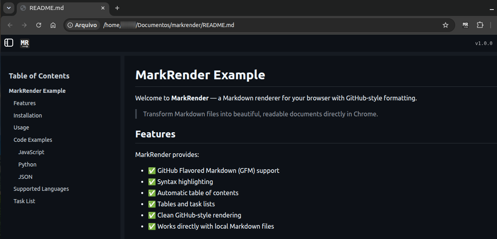
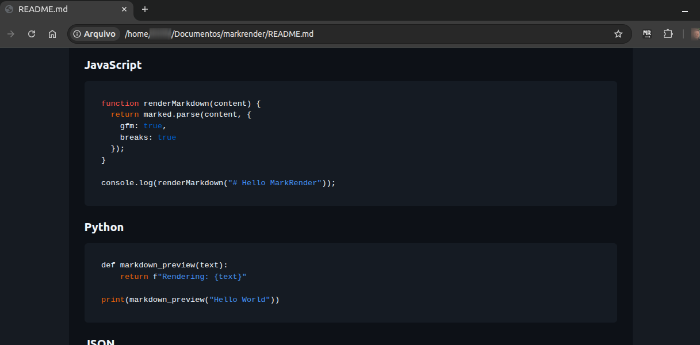

# MarkRender

A Chrome extension that renders local Markdown files directly in your browser with GitHub Flavored Markdown (GFM) support.

## Features

* Render local Markdown files in your browser
* GitHub Flavored Markdown support
* Automatic table of contents (TOC)
* Syntax highlighting for code blocks
* GitHub-style Markdown rendering
* Support for Markdown files:

  * `.md`
  * `.markdown`
  * `.mdown`
  * `.mkd`
  * `.mkdn`

## How It Works

MarkRender runs locally in your browser and transforms Markdown files into a readable rendered view.

The extension only processes local Markdown files (`file://`) and does not access or transmit your data.

## Installation

### From Chrome Web Store

Coming soon.

### Manual Installation (Developer Mode)

1. Clone this repository:

```bash
git clone https://github.com/suncodesapps/markrender.git
```

2. Open Chrome and go to:

```
chrome://extensions
```

3. Enable **Developer mode**.

4. Click **Load unpacked**.

5. Select the extension folder.

6. Open a local Markdown file.

## Permissions

MarkRender requires access to local files to render Markdown documents.

The extension:

* only works with local Markdown files;
* does not collect personal data;
* does not send files to external services.

## Screenshots

### GitHub-style Markdown rendering



### Syntax highlighting



## Development

The extension uses:

* Manifest V3
* JavaScript
* [Marked.js](https://marked.js.org/) for Markdown parsing
* [Highlight.js](https://highlightjs.org/) for syntax highlighting
* [GitHub Markdown CSS](https://github.com/sindresorhus/github-markdown-css) for GitHub-style rendering


## License

MIT License

## Author

SunCodes Apps
